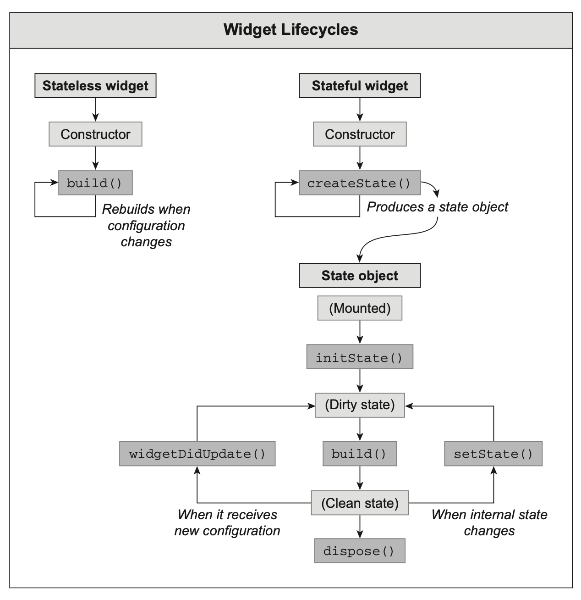

> 首先说明，该教程会教给大家很多先进技术，但并不是为了教会大家某种单项技能，因为只会单项技能只能做打工人。我们的目的是在创业实践中锻炼大家的管理能力、项目能力，以期为社会创造价值。

## Design Philosophy

### 解耦原本混乱不堪的 CSS

CSS 是 Web 开发的标准语言，因语法简洁、功能强大也被设计界所接纳。但是新标准不断提出，而 CSS 依然保持着以往的平铺直叙的语法（现在 CSS 标准有五百多条，算上非官方标准有一千余条），工程变得越来越难以维护。

很大一个影响因素是，CSS 中很多属性是相互依赖的，比如 `position`、`float`、`display`、`overflow`、`z-index` 等等，这些属性的值是相互影响的，这种例子不胜枚举，比如

* `display` 的值为 `inline` 时，`width`、`height`、`margin`、`padding` 的值就没有意义了
* 对于文本，`overflow` 的值为 `hidden` 时，`width`、`height` 的值才有意义
* `position` 非 `static` 时，`z-index`，`top`、`left`、`right`、`bottom` 的值才有意义，否则被忽略也不报错。
* `float` 和 `margin` 一起使用时，谁用谁知道。

这样的代码不分层级散落在大括号里，很难维护，也很难调试。即使有原子 CSS 库，也不能从本质上解决问题。

在 Flutter 的 Material 库中，我们可以看到 `ConstrainedBox`、`Padding`、`SizedBox` 等组件，它们的功能是相互独立的，不会相互影响，代码容易编写、容易维护、容易复用、容易重构。

### 组合大于继承

在 `Flutter` `Widget` 是页面布局的基本组件，它可以被组合、被继承，也可以被重用。`Widget` 之间的关系是一种组合关系，而不是继承关系。但如果继承关系是必须的，那么 `Flutter` 也提供了 `InheritedWidget`，它可以让 `Widget` 之间建立继承关系。但这里的继承只是复用逻辑，而不是为了布局。

## Widget 生命周期



> ##### *Flutter In Action*, Manning.


> https://zhulg.github.io/posts/f4ca6a79.html

* `createState`: 该函数为 `StatefulWidget` 中创建 `State` 的方法，当 `StatefulWidget` 被创建时会立即执行 `createState` 。
* `initState`: 该函数为 `State` 初始化调用，因此可以在此期间执行 `State` 各变量的初始赋值，同时也可以在此期间与服务端交互，获取服务端数据后调用 `setState` 来设置 `State`。该方法必须调用`super`，因为父类中会进行一些其他操作；不过，因为请求数据时间较长，所以在 `initState` 中执行网络请求，会导致 `Widget` 无法渲染，因此可以在 `didChangeDependencies` 中执行网络请求。
* `didChangeDependencies`: `InheritedWidget` 独有。该函数是在该组件依赖的 `State` 发生变化时，即初始化(`initState`)时，或者是外部传递过来的数据发生改变(`InheritedWidget`)。例如：父组件在子组件创建时传入参数 `name`，子组件使用 `name`，那么当父组件的 `name` 更新时，子组件的 `name` 也会随之更新，并调用该方法通知，以便于更新**加工数据**
* `build`: 主要是返回需要渲染的 `Widget` ，由于 `build` 会被调用多次，因此在该函数中**只能做返回 `Widget` 相关逻辑，一定不能执行其他逻辑**，尤其**不能进行网络请求**，因为 `build` 会被调用多次，如果执行网络请求，那么会导致多次执行网络请求，这是不合理的。如果需要执行网络请求，可以在 `initState` 中执行，或者在 `didChangeDependencies` 中执行。
* `didUpdateWidget`: 该函数主要是在组件重新构建，比如父组件发生 `build` 、热重载的情况下，子组件该方法才会被调用，其次该方法调用之后一定会再调用本组件中的 `build` 方法。
* `deactivate`: 在组件被移除节点后会被调用，如果该组件被移除节点，然后未被插入到其他节点时，则会继续调用 `dispose` 释放组件
* `dispose`: 释放组件，移除内存资源。注意 `Controller` **必须**在此方法中释放，否则会造成内存泄漏。重载后必须调用 `super.dispose`。
* `reassemble`: 主要是提供开发阶段使用，在 debug 模式下，每次热重载都会调用该函数。

下面是 `StateFulWidget` 的生命周期代码简介，以及通过 `widget`使用 `StatefulWidget` 从外侧接收到的数据（此数据一般为`final`仅供内部使用），也同时介绍了 `构造方法` 以及 `widget`的使用

```js
class HomeTabBar extends StatefulWidget {
  final String title;

  // 默认的构造方法，接收参数有几种形式
  // 默认,必须要实现的
  const HomeTabBar({Key? key}) : super(key: key);

  // 当我们有其他构造方法的时候，必须要传入，否则要给定默认值，有三种情况
  // 可以采用多个参数的形式传递，和dart学习的时候一样，需要按顺序传递参数
  const HomeTabBar(this.title, {Key? key}) : super(key: key);

  // 下面的方式为推荐手段
  // 使用对象的方式传递参数，该方式为默认方式，参数前需要加入 require，必须要传递参数
  // 注意：如果参数为可选类型 String? title,那么不需要加上 require
  const HomeTabBar({Key? key, required this.title}) : super(key: key);
  //使用对象的方式传递参数，当使用默认值的时候，使用该方式传递，不传使用默认值
  const HomeTabBar({Key? key, title='Marshal'}) : super(key: key);

  @override
  State<HomeTabBar> createState() => _HomeTabBarState();
}

class _HomeTabBarState extends State<HomeTabBar> {
  int age = 10;
  //初始化状态时使用，我们可以在这里设置state状态
  //也可以请求网络数据后更新组件状态
  @override
  void initState() {
    // TODO: implement initState
    super.initState();
  }

  //state发生变化时会回调该方法,可以是class
  //也可以是InheritedWidget,即其实际所属的组件(上面那个组件)
  @override
  void didChangeDependencies() {
    // TODO: implement didChangeDependencies
    super.didChangeDependencies();
  }

  //父组件发生变化时，会调用该方法，随后调用 build 方法重新渲染，用的少
  @override
  void didUpdateWidget(covariant HomeTabBar oldWidget) {
    // TODO: implement didUpdateWidget
    super.didUpdateWidget(oldWidget);
  }

  //组件被从父节点移除时回调的方法，如果没插入到其他节点会随后调用dispose完全释放
  //如果该组件被移除，但是仍然被组件关联，则不会随后释放并调用dispose
  @override
  void deactivate() {
    // TODO: implement deactivate
    super.deactivate();
  }

  //完全释放该组件时调用,不建议做本组件的内存操作，可以移除其他组件或者保存的内容
  @override
  void dispose() {
    // TODO: implement dispose
    super.dispose();
  }

  //debug情况下调用，每次热重载都会回调
  @override
  void reassemble() {
    // TODO: implement reassemble
    super.reassemble();
  }

  @override
  Widget build(BuildContext context) {
      return Text('名字:${widget.title}，年龄:$age');
  }
}
```

> 作者：剪刀石头布啊
>
> 链接：https://juejin.cn/post/7078586717603069988
>
> 来源：稀土掘金
>
> 著作权归作者所有。商业转载请联系作者获得授权，非商业转载请注明出处。

## 多 `children` 布局组件

* Flex 布局
  * `Row`
  * `Column`
  * `Flex`
* 流式布局
  * `Wrap`
  * `Flow`
* 层叠布局
  * `Stack`
    * `Positioned`

## Flutter 布局过程

如果学过编译原理，对编译器如何遍历抽象语法树（Abstract Syntax Tree, AST）应该不陌生。`Flutter` 的布局过程也是类似的，不过它会生成三棵树：
1. `Widget` 树
2. `Element` 树
3. `RenderObject` 树

我们先不去讲复杂的原理，但对于编程，以下辅助组件是重要的：

* `LayoutBuilder`：拿到父组件传递的约束

## 列表组件

相信很多软件不会是单个页面，比如新闻列表，Todo List 需要滚动，这时候需要用到列表组件。

### 基础列表

* `ListView`
* `GridView`
* `TabbarView`
* `PageView`

### `CustomScrollView` 和 `Sliver`

### 功能型组件

* `ValueListenableBuilder`
* `FutureBuilder`
* `StreamBuilder`

### 事件处理

* `GestureDetector`

## 控制组件状态

控制自己的状态比较简单，但是控制子组件的状态就比较复杂了，比如 `TextField` 的内容等。

在 `Flutter` 中，子组件控制父组件状态，是通过回调实现的。比如，给子组件传进一个包含 `setState` 的回调函数，子组件在合适的时机调用这个回调函数，父组件就会更新状态。

`Controller` 是 `Flutter` 中的一个重要概念，它可以让父组件控制子组件的状态，比如 `TextEditingController` 可以控制 `TextField` 的内容。

## 路由

你的 APP 一定不会只有一个页面，这时候就需要用到路由了。可以把路由理解为一个页面栈，当你打开一个新页面时，就会把新页面压入栈顶，当你关闭一个页面时，就会把栈顶的页面弹出。

管理路由的类是 `Navigator`，它提供了一些方法，比如 `push`、`pop`、`pushNamed`、`popUntil` 等等。

## 主题

`Flutter` 中的主题是通过 `ThemeData` 来管理的，它是一个 `Map`，`Map` 的键是 `Material` 组件的 `Type`，值是一个 `Map`，这个 `Map` 的键是 `Material` 组件的属性，值是属性的值。

## `MediaQuery`

`MediaQuery` 是 `Flutter` 中一个重要的组件，它可以让我们获取设备的一些信息，比如屏幕的宽高、设备的像素密度、系统的语言等等。

## 导航栏

导航栏是 APP 中最常见的组件，它可以让用户在不同的页面之间切换。

对 `Flutter` 本身的介绍暂时就到这里，但 `Flutter` 能提供的远不止于此，它还提供了

* 动画
* 文件/网络 IO
* 自绘组件
* 原生插件扩展

等高级功能，能让你的 APP 更加丰富。

* `Key`：一般情况下不需要考虑，但如果有**大量同类 `Widget` 的排序、删除、插入**的需求时，就需要考虑 `Key` 了。

可以去 GitHub 上搜索 `flutter`，会发现很多样例 APP。

## 包管理

* `pub.dev`
* `pubspec.yaml`
* 使用包（以 `fluttertoast` 为例）
* 包冲突与解决
* 一些常用的 `Flutter` 组件，比如 `fluttertoast`、`flutter_swiper`、`flutter_staggered_grid_view`、`fluwx` 等。

## 高级状态管理

Flutter 基本的状态管理方式是通过 `setState` 来实现的，但是这种方式有一个缺点，就是当组件层级关系比较复杂，使用 `State` 方式会让组件变得非常复杂。比如，用户信息（用户名、用户头像）在页面的很多地方都要用到，最好有一个统一的状态提供者。`Provider` 是利用“生产者-消费者”模式解决状态管理问题的。

首先，我们从 `pub.dev` 上获取 `provider`

```yaml:
dependencies;
  provider: ^6.0.5
```

然后，我们在 `main.dart` 中使用 `Provider` 包装 `MyApp` 组件

```dart
import "package:flutter/material.dart";
import 'package:provider/provider.dart';

class Counter with ChangeNotifier {
  int _count = 0;
  int get count => _count;

  void increment() {
    _count++;
    notifyListeners();
  }
}

void main() {
  runApp(
    ChangeNotifierProvider<Counter>(
      create: (context) => Counter(),
      child: MyApp(),
    ),
  );
}

class MyApp extends StatelessWidget {
  @override
  Widget build(BuildContext context) {
    return MaterialApp(
      title: 'Flutter Demo',
      theme: ThemeData(primarySwatch: Colors.blue),
      home: MyHomePage(),
    );
  }
}

class MyHomePage extends StatelessWidget {
  @override
  Widget build(BuildContext context) {
    return Scaffold(
      appBar: AppBar(title: Text('Provider Demo')),
      body: Center(
        child: Column(
          mainAxisAlignment: MainAxisAlignment.center,
          children: <Widget>[
            Text('You have pushed the button this many times:'),
            Consumer<Counter>(
              // 使用 Consumer 包裹需要更新的组件
              builder: (context, counter, child) {
                return Text(
                  '${counter.count}',
                  style: Theme.of(context).textTheme.headline4,
                );
              },
            ),
          ],
        ),
      ),
      floatingActionButton: FloatingActionButton(
        onPressed: () {
          Provider.of<Counter>(context, listen: false).increment();
        },
        tooltip: 'Increment',
        child: Icon(Icons.add),
      ),
    );
  }
}
```

其中，`Provider` 需要放在状态的根节点上，这样所有的子组件都可以通过 `Provider.of` 来获取状态。

- `ListenableProvider`：`Listenable` 是 `Flutter` 中的一个接口，它可以监听数据的变化，比如 `ValueNotifier`、`ChangeNotifier` 等。`ListenableProvider` 可以让我们在 `Listenable` 中获取数据。
- `ChangeNotifierProvider`：`ChangeNotifier` 是 `Listenable` 的一个实现类，它可以监听数据的变化，当数据发生变化时，会通知所有的监听者。`ChangeNotifierProvider` 可以让我们在 `ChangeNotifier` 中获取数据。
- `ValueListenableProvider`：`ValueListenableProvider` 可以让我们在 `ValueListenable` 中获取数据，将其提供给子树。
- `StreamProvider`：`Stream` 是一种异步的数据流，它可以用来监听网络请求、数据库变化等事件。`StreamProvider` 可以让我们在 `Stream` 中获取数据。

## 连接前端与后端

广义上的跨进程通信

单机跨进程通信方案：

* 管道
* 消息队列
* 共享内存
* Semaphore
* 网络

> 参考：<https://xiaolincoding.com/os/4_process/process_commu.html>

跨主机跨进程通信：网络

### 网络请求

+ `pub.dev`
+ `pubspec.yaml` 导入 `http` 包
+ `HTTP` 基础（`curl -v` & `WireShark` 抓包实践）

* `Protobuf`

## 异步：承诺（Promise）与未来（Future）

`JavaScript` 中的 `Promise` 是一种异步编程的解决方案，它可以让我们在异步操作完成后，以同步的方式处理结果。但考虑到我们要建立“学 Dart 不需要先会 JS”的概念，我们直接讲 `Future`。

## MISC

* `Dart` 的一些内置数据结构
  + `Map`
  + `Set`
  + `List`
* `devtools`

## 项目：个人字典

* 输入框
* 网络请求
* 单词列表

`pub.dev` 包管理
`Navigator` 路由管理

项目：做一个简单的翻译软件（调用彩云 API）
